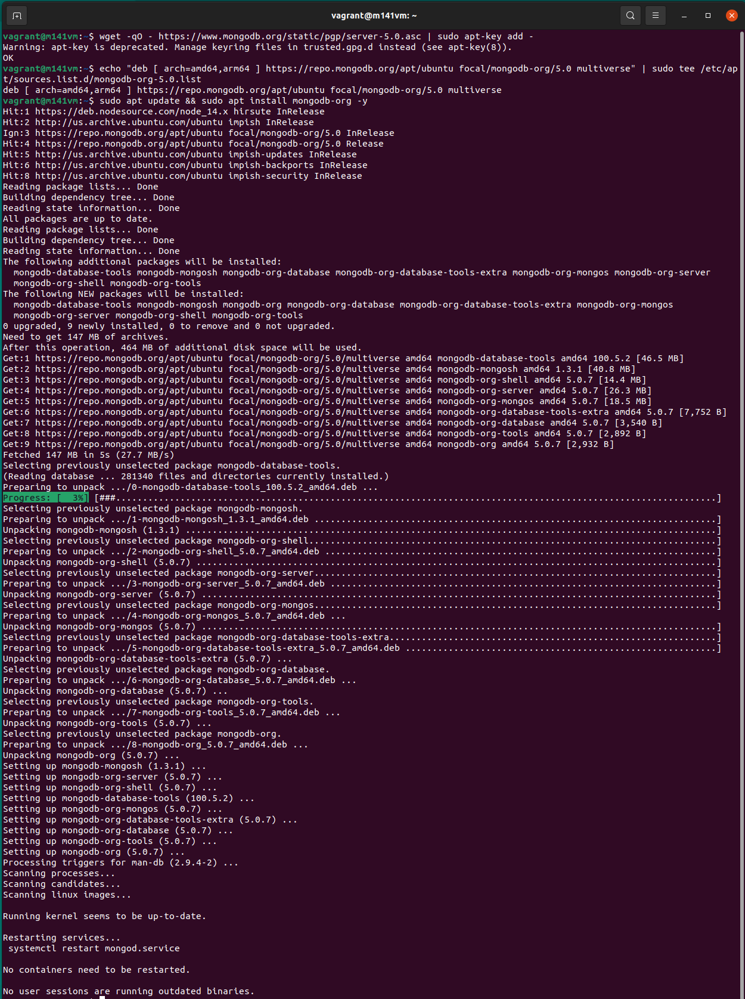

# Installation, Konfiguration und Recherche

## Recherche

### Vorteile

* Für unstrukturierte Daten
* Performance kann besser sein
* horizontale Skalierbarkeit
* Einfaches JSON-Format (Auch merhdimensionale Arrays möglich)
* Kann grössere Datenmengen managen

### Nachteile

* Weniger geeignet für Applikationen mit vielen Realationen
* Keine Transaktionen

### Anwedungen von MongoDB

* Messdaten ohne Relationen
* Adobe
* Google
* Toyota
* Bosch

Oft auch einfach nur ein Teil einer Applikation und nicht die Haupt DB. Für grosse Unternehmen einfach Skalierbar.

### Hersteller und Lizenzen

MongoDB ist eine eigene Firma mit Sitz in den USA. Das Produkt ist lizenziert unter SSPL (Service Side Public License)

### Support

* [Lifecycle (generell 30 Monate nach Major release)](https://www.mongodb.com/support-policy/lifecycles)
* [Support policies (je nach Plattform anders)](https://www.mongodb.com/support-policy/)

### Features

* Eine Datenbank besteht aus ```Collections``` (Tabellen), welche ```Documents``` (Tupel/Datensätze) enthalten. Ein Document beinhaltet ```Fields``` (Attributen)
* (Mehrdimensionale) Arrays können direkt gespeichert werden
* Es braucht nicht wie in MySQL vordefinierte Models (Struktur) für Documents.
* Einfach Skalierbar

### Begriffe

RDBMS       | MongoDB
------------|-------------
Database    | Database
Table       | Collection
Tuple/Row   | Document
column      | Field
Table Join  | Embedded Documents
Primary Key | Primary Key (Default key _id provided by MongoDB itself)

## Installation

### Voraussetzungen

MongoDB installieren wir direkt aus einem apt-repository von MongoDB. Die Version ist 5.0.7 sowie auch deren meisten Komponenten/Abhängigkeiten.
Dazu müssen aber folgende Schritte durchgeführt werden.

### Apt-Key für Updates (für Security notwendig)

```bash
wget -qO - https://www.mongodb.org/static/pgp/server-5.0.asc | sudo apt-key add -
```

### Apt Update Quellen hinzufügen

```bash
echo "deb [ arch=amd64,arm64 ] https://repo.mongodb.org/apt/ubuntu focal/mongodb-org/5.0 multiverse" | sudo tee /etc/apt/sources.list.d/mongodb-org-5.0.list
```

### Quellen updaten und MongoDB installieren

```bash
sudo apt update && sudo apt install mongodb-org -y
```

### Was wurde installiert

MongoDB wurde in der Version 5.0.7 installiert. Sowie deren Abhängigkeiten ```mongodb-org-server, mongodb-org-shell, mongodb-org-mongos, mongodb-org-database, mongodb-org-tools und mongodb-org```. Das einzige Paket, welches in einer anderen Version (100.5.2) installiert wurde, ist ```mongodb-org-database-tools``` und ```mongodb-mongosh``` in der Version 1.3.1. Mongosh ist vergleichbar mit dem mysql-client, welcher einfach eine Verbindung zum Server aufbaut.

Kurz zusammengefasst:



## Konfiguration

### MongoDB Service

```bash
sudo nano /lib/systemd/system/mongod.service
```

Hinzufügen (sofern noch nicht enthalten):

```[Service]
# Other directives omitted
# (file size)
LimitFSIZE=infinity
# (cpu time)
LimitCPU=infinity
# (virtual memory size)
LimitAS=infinity
# (locked-in-memory size)
LimitMEMLOCK=infinity
# (open files)
LimitNOFILE=64000
# (processes/threads)
LimitNPROC=64000
```

Service neustarten:

```bash
sudo systemctl restart mongod
```

Service immer automatisch starten:

```bash
sudo systemctl enable mongod.service
```

### Weitere Ordner

Daten von MongoDB (Indexe, Collections etc.):

```/var/lib/mongodb```

Log Ordner von MongoDB:

```/var/log/mongodb```

Konfiguration von MongoDB (IP, Port, Datapath, Logpath etc.):

```/etc/mongod.conf```

## Mongo testen

Wenn [Erste Schritte](dokumentationsauftraege/mongodb/mongodb_erste_schritte.md) funktioneren, ist MongoDB erfolreich installiert.