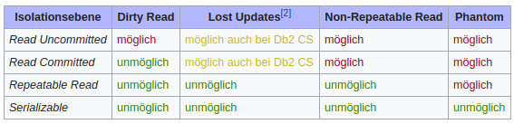

# Begriffe und historisches

## Historisches zu Datenbanken

### SQL (Structured Query Language)

Mithilfe von ```SELECT, INSERT, DELETE und UPDATE``` fragt man Daten ab, setzt neue in die Datenabnk ein, bearbeitet oder löscht sie.

### SQL DDL (Data Definition Language)

Mithilfe von ```CREATE und DROP``` erstellt man oder löscht eine Datenstruktur. (Tabellen)

### SQL DML (Data Manipulation Language)

Mithilfe von ```ALTER``` kann man Spalten (Attribute) hinzufügen, bearbeiten oder löschen.

## Begrifflichkeiten und Abkürzungen

### Transaktion

Eine Transaktion beinhaltet ein oder mehrere SQL-Statements. Diese werden nacheinander ausgeführt. Falls ein Befehl in dieser Transakation fehlschlägt, kann ein Rollback gemacht werden, ohne dass produktive Daten auf der Datenbank verändert  wurden. Wenn die Transaktion erfolgreich ist, kann sie commited werden und auf die Datenbank übernommen werden.

### ACID

* A = Atomicity / Abgeschlossenheit
* C = Consistency / Konsistenz
* I = Isolation / Isolation
* D = Durability / Dauerhaftigkeit

**Atomicity** beschreibt die Zielsetzung, dass Datenveränderungen mittels einer Transaktion ganz oder gar nicht ausgeführt werden. Falls ein Befehl in der Transaktion fehlschlägt, werden alle anderen Befehle rückgängig gemacht (Rollback).

**Consistency** beschreibt die Einhaltung der Integritätsbedingungen. Das heisst, dass die Relationen (Beziehungen in andere Tabellen z.b User --> Projekte) korrekt sind.

**Isolation** beschreibt, dass jede Befehlsfolge (Transaktion) nacheinander ausgeführt wird. So wird nicht ausversehen etwas negativ verändert / überschrieben. Deshalb werden Tabellen für diese Zeit gelockt / gesperrt. Dies reduziert aber massiv die Performance. Man wartet bis jemand seine Daten vollständig in die DB geschrieben hat.

**Durability** beschreibt, dass die Daten nach einer erfolgreichen Transaktion dauerhaft in der Datenbank gespeichert sind.

### BASE

* **B**asically **A**vailable
* **S**oft state
* **E**ventual consistency  
Basically Available (BA) steht dafür, dass die Daten grundsätzlich verfügbar sind, aber verloren gehen könnten (S). Eventuell sind diese Daten auch konsistent gespeichert. (E)  
Datenbankhersteller sind teilweise eher am BASE-Prinzip interessiert, wenn es um performance geht.

### CAP

* **Consistency** beschreibt die Konsistenz
* **Availability** beschreibt die Verfügbarkeit
* **Partition Tolerance** beschreibt die Verteilbarkeit der Daten, sowie die Ausfalltoleranz

Das Problem hier: Man kann eigentlich nur 2 der 3 Dinge wirklich realisieren.

* **CA:** Wenn die Konsistenz und Verfügbarkeit wichtig ist, ist es sehr schwierig die Daten verteilt aufzubewahren. Wäre z.B eine Datenbank im Keller einer Firma.
* **CP:** Wenn die Konsistenz und Verteilbarkeit der Daten wichtig ist, leidet wiederum die Verfügbarkeit. Es wird eigentlich gewartet bis alle Daten verteilt sind und Konsistent sind (überall gleich) und deshalb dauert es länger, bis die Daten verfügbar sind.
* **AP:** Wenn die Verfügbarkeit und Verteilbarkeit wichtig ist, ist es schwierig konsistente Daten zu haben. Verteilung auf dem Globus dauert halt, deshalb wenig Konsistenz. Da die Verfügbarkeit wichtig ist, wird auch nicht gewartet bis alle Daten synchron ist.

### Transaktionen

Eine Transaktion ist eine Folge von Programmabschnitten (z.B mehrere SQL Befehle), welche nur fehlerfrei und vollständig oder gar nicht ausgeführt werden. Der Datenbestand ist also sehr konsistent.
Bei Transaktionen können aber nun folgende Probleme auftreten:

* **Dirty Read:** Daten einer noch nicht abgeschlossenen Transaktion (uncommited) werden von einer anderen Transaktion gelesen.
* **Lost Updates:** Zwei Transaktionen modifizieren parallel denselben Datensatz und nach Ablauf dieser beiden Transaktionen wird nur die Änderung von einer von ihnen übernommen.
* **Non-Repeatable Read:** Wiederholte Lesevorgänge liefern unterschiedliche Ergebnisse.
* **Phantom Read:** Suchkriterien treffen während einer Transaktion auf unterschiedliche Datensätze zu, weil eine (während des Ablaufs dieser Transaktion laufende) andere Transaktion Datensätze hinzugefügt, entfernt oder verändert hat.

Bei folgenden der 4 oben genannten Punkten kann an gewissen Orten etwas eingeschränkt werden, damit die performance verbesstert wird. Jedoch kann hier die Konsistenz der Daten drastisch abnehmen.



### Praxisbeispiel and PostgreSQL

PostgreSQL ist ein Objekt-Relationales DBMS. Eine Objekt-Relationale Datenabank gibt dem Programmierer ein bisschen mehr Mölgichkeiten. Daten werden eigentlich in einem Objekt gespeichert und sind so schneller verfügbar. Seit 2001 ist dieses DBMS auch ACID Konform.

* Mithilfe von SQL-Standards können Transaktionen ganz oder gar nicht ausgeführt werden. (Atomicity)
* Die Datenintegrität (Consistency) ist gewährleistet. Bei PostgreSQL sind das Schlüsselwörter wie UNIQUE (Einzigartig), NOT NULL, Primary oder Foreign Keys.
* PostgreSQL bietet Isolation levels vom SQL-Standard an inklusive serializable. Ein SQL-Standard wäre ```read commited```, das heisst Änderungen, welche jemand mit einer Transaktion gemacht hat, aber noch nicht ```commited``` wurden, können nicht gelesen werden. Ansonsten wären das die ```Dirty Data``` von oben. Serializable bedeutet, dass alles schön nacheinander ausgeführt wird. (Tabelle wird gesperrt)
* Die Dauerhaftigkeit der Daten sind bei PostgreSQL natürlich gewährleistet, sofern eine Transaktion commited wurde.

Quellen: 

* https://www.postgresql.org/about/
* https://sqlperformance.com/2014/04/t-sql-queries/the-read-committed-isolation-level
