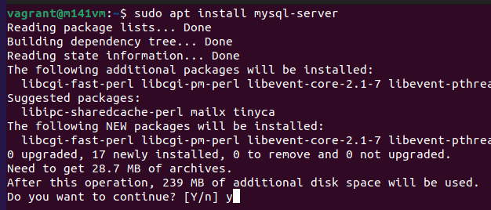
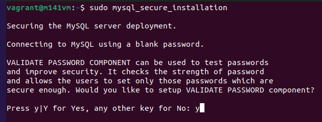
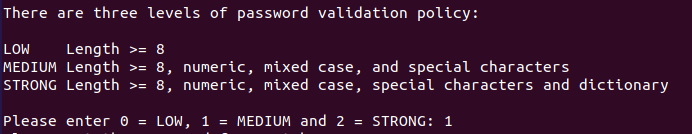
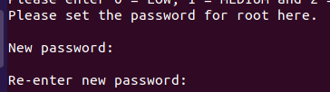
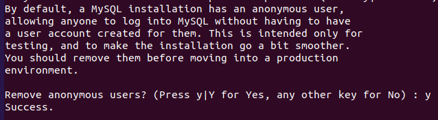
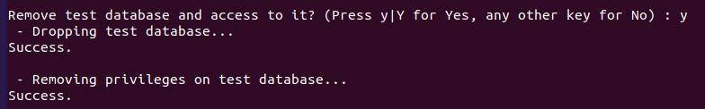
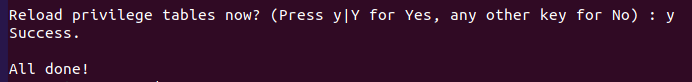
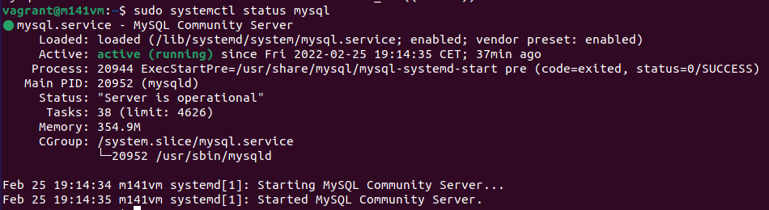
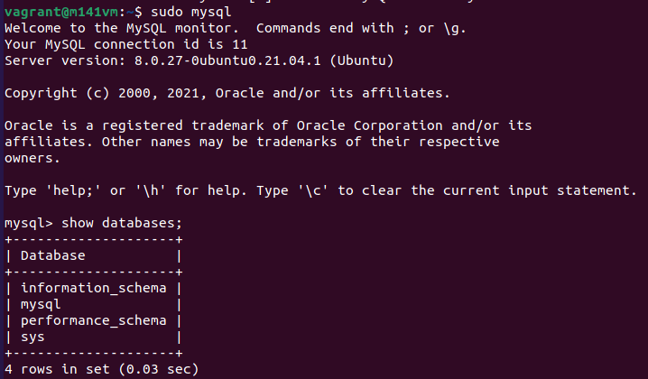

# MySQL Installation

## Recherche MySQL

Der Hersteller von MySQL ist Oracle. MySQL hat ein Dual-Lizenz-Model. Wer FOSS (Free and Open Source Software) unter der GPL Lizenz veröffentlicht, darf die OpenSource Variante von MySQL gratis nutzen. (Lizenzhinweis ist trotzdem Pflicht!). Siehe https://www.mysql.com/about/legal/licensing/oem/
Wer kommerzielle (Closed Source) Software verkaufen will und eine MySQL DB nutzt muss einen Vertrag mit Oracle eingehen und zahlt dazu je nach Edition mehrere 10'000$. Siehe https://shop.oracle.com/apex/product?p1=MySQL
Dafür hat man dort dann aber aktuellen Support. (Administration Tools, versprechen für grosse Ausfallsicherheit, längere Security Patches etc.)
MySQL ist ein RDBMS (Relationales Datenbank Management System), welches sich sehr gut eignet, wenn man eben Relationen hat. Z.B User und Bestellungen oder Bestellungen und Produkte. MySQL verfolgt das Client-Server Model. Die Daten liegen auf dem mysql-server welche mit einem mysql-client abgerufen/erstellt werden können. Ca. alle 3 Monate kommt vom Server eine neue Version. Alles unter der Version 5.7 ist nicht mehr supported und 5.7 ist noch bis ca. Oktober 2023 supported. Wer länger support will muss auf Version 8 umsteigen welche noch bis April 2026 unterstützt wird. Warum von 5 direkt auf 8 gesprungen wurde hat ein Grund. 6 ist die Version, welche für etwas spezielles gedacht war, aber eher gescheitert ist. Die 7 war gedacht für Clustering, aber nun hat man alles in der Version 8 zusammengefasst. Unterstützte Plattformen findet man hier: MySQL unterstütze Plattformen: https://www.mysql.com/support/supportedplatforms/database.html

## Voraussetzungen

Ich setze eine 64-bit Ubuntu 21.04 (hirsute) VM mit dem Linux Kernel 5.11.0-49-generic ein. (Virtualisiert auf HP Spectre 15, Intel i7 8th Gen)
MySQL installiere ich mittels dem Paketmanager ```apt``` in der aktuellsten Version (freigegeben für hirsute) ein (https://packages.ubuntu.com/hirsute/mysql-server), obwohl ich lieber Docker hätte. ;) Im Moment ist der MySQL-Client sowie der MySQL-Server die Version 8.0.27.

Folgende Dienste (welche einen Netzwerkport belegen) laufen auf dem Server:

```bash
sudo ss -ltnp
```

Gibt eine schöne Ausgabe aus:

```output
State     Recv-Q    Send-Q       Local Address:Port        Peer Address:Port    Process
LISTEN    0         4096         127.0.0.53%lo:53               0.0.0.0:*        users:(("systemd-resolve",pid=723,fd=1))
LISTEN    0         128                0.0.0.0:22               0.0.0.0:*        users:(("sshd",pid=965,fd=))
LISTEN    0         128              127.0.0.1:631              0.0.0.0:*        users:(("cupsd",pid=816,fd=))
LISTEN    0         4096                     *:9100                   *:*        users:(("node_exporter",pid=917,fd=))
LISTEN    0         128                   [::]:22                  [::]:*        users:(("sshd",pid=965,fd=))
LISTEN    0         128                  [::1]:631                 [::]:*        users:(("cupsd",pid=816,fd=))
```

Es läuft der lokale DNS-Dienst, Ein CUPS Printserver (IPv4 und IPv6), SSH-Server (IPv4 und IPv6) und ein Nodewebserver auf Port 9100

## Installation

Erstmals das ganze System updaten:

```bash
sudo apt update && sudo apt upgrade
```

MySQL-Server installieren:

```bash
sudo apt install mysql-server
```

Es wird angezeigt, was alles dazu installiert wird. Dies mit ```y``` und ```Enter``` bestätigen:



Irgendwelche Librarys (damit der Server funktioniert):

* libcgi-fast-perl, libcgi-pm-perl, libevent-core-2.1-7, libevent-pthreads-2.1-7, libfcgi-bin, libfcgi-perl, libfcgi0ldbl, libhtml-template-perl, libmecab2

Irgendwas für die Japanische Sprache:

* mecab-ipadic
* mecab-ipadic-utf8
* mecab-utils,

MySQL Client, um Verbindungen zum Server herstellen zu können:

* mysql-client-8.0
* mysql-client-core-8.0 

MySQL Server selbst:

* mysql-server
* mysql-server-8.0
* mysql-server-core-8.0

Der MySQL-Server ist im Moment aber noch gar nicht geschützt. (z.B kein root Passwort) Deshalb kann über folgenden Befehle ein kleiner und sicherer Installationsguide gestartet werden.

```bash
sudo mysql_secure_installation
```

Folgende Settings setzen:

* VALIDATE PASSWORD COMPONENT (prüft, ob ein genug starkes Passwort verwendet wird): ```y```



* Level der Passwortstärke auswählen: ```1```



* Passwort für Benutzer root eingeben, Enter und Passwort wiederholen



* Anonyme Benutzer entfernen (standardmässig ist einer dabei, der sich verbinden könnte): ```y```



* Remote login mit root deaktivieren (sicher ist root nur von localhost zulassen): ```y```


* test Datenbank und Zugriffe löschen: (test DB wird standardmässig mitinstalliert) ```y```



* Privilegien Tabelle neu laden: ```y```



Die Privilegien Tabelle ist die Tabelle, welche sagt welcher Benutzer auf was Zugriff hat. Im Hintergrund wird der SQL Befehl ```FLUSH PRIVILEGES``` ausgeführt, damit die gelöschten User auch sicher keinen mehr Zugriff haben.

Autostarten des MySQL Service:

```bash
sudo systemctl enable mysql
```

Starten des MySQL Service (falls noch nicht passiert):

```bash
sudo systemctl start mysql
```

## Testen

Überprüfen des MySQL Service:
Status des MySQL Service:

```bash
sudo systemctl status mysql
```

Sollte etwas so aussehen (Grüner Punkt!):


Version und andere Information auslesen:

```bash
sudo mysqladmin -o -u root version
```

Sollte folgendes ausgeben:

```output 
mysqladmin  Ver 8.0.27-0ubuntu0.21.04.1 for Linux on x86_64 ((Ubuntu))
Copyright (c) 2000, 2021, Oracle and/or its affiliates.

Oracle is a registered trademark of Oracle Corporation and/or its
affiliates. Other names may be trademarks of their respective
owners.

Server version		8.0.27-0ubuntu0.21.04.1
Protocol version	10
Connection		Localhost via UNIX socket
UNIX socket		/var/run/mysqld/mysqld.sock
Uptime:			32 min 29 sec

Threads: 2  Questions: 16  Slow queries: 0  Opens: 131  Flush tables: 3  Open tables: 50  Queries per second avg: 0.008
```

MySQl-Shell starten:

```bash
sudo mysql
```

Datenbanken anzeigen:

```sql
show databases;
```

Sollte etwas so aussehen:

