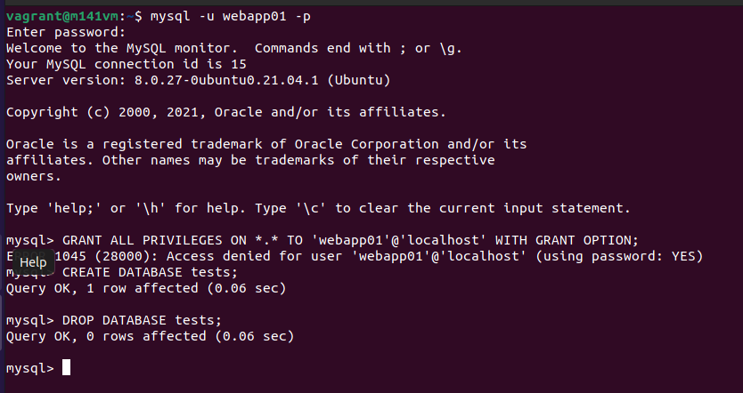
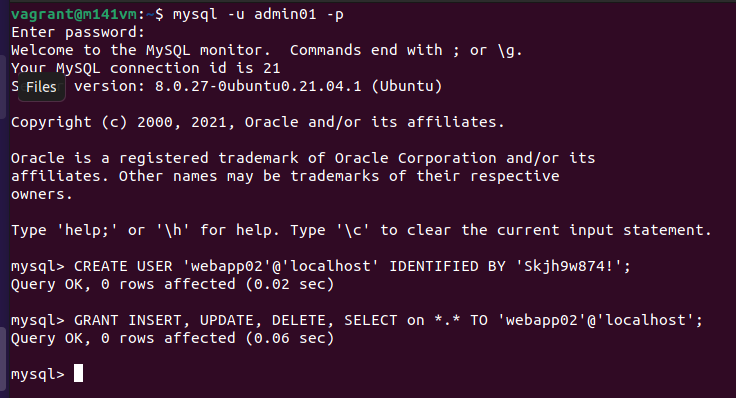

# MySQL Konfiguration

## Storage Engines

```InnoDB und MyISAM``` sind die 2 wichtigsten Storage Engines von MySQL. Ein Storage Engine ist dazu da, wie die Daten auf der Festplatte oder im RAM gepseichert werden. 

### InnoDB

Bei MySQL ist die verbreiteste und eine der wichtigsten die InnoDB Engine. Sie unterstützt [Transaktionen](dokumentationsauftraege/mysql/begriffe_historisches?id=transaktionen), ist komplett [ACID Konform](dokumentationsauftraege/mysql/begriffe_historisches?id=acid) und unterstützt die Sperrung auf Zeilenebende, damit Ein Datensatz nicht gleichzeitig gelesen/bearbeitet wird. Es ist die einzige Engine die Integrität für relationen (Fremdschlüssel) bietet.

### MyISAM

MyISAM baut auf ISAM (nicht mehr supported) auf. Es war die frühere Engine von MySQL. Allerdings unterstützt sie kein oder nicht komplett das ACID Konzept. Sie bietet jedoch sperre auf Tabellenebene an. Es können keine Transaktionen gemacht werden und es bestehen keine Beziehungen (Fremdschlüssel) in andere Tabellen. Die Engine ist sehr simple, geeignet für Fulltext Search in der DB (InnoDB kann dies heute jedoch auch) und ist performant wenn man hauptsächlich nur Lesen muss und die Datenintegrität nicht so wichtig ist.

### Andere Engines

MySQL-Shell starten:

```bash
sudo mysql
```

Engines anzeigen:

```sql
show engines;
```

#### CSV

Mit der CSV-Engine werden die Daten im CSV-Format (Komma separiert) gespeichert. Dies ist nützlich wenn die Daten mit anderen Applikation (z.B Excel) geteilt/eingelesen werden müssen.

#### ARCHIVE

Mit der ARCHIVE-Engine werden Daten nach dem speichern sofort komprimiert. Diese Engine eignet sich am besten, wenn Daten archiviert weren müssen und daher selten gelesen werden.

#### BLACKHOLE

Mit der BLACKHOLE-Engine kann man Daten sofort wieder vernichten. Verlgleichbar mit UNIX-Systemen bei denen man einen Befehl ausführt, aber den Output direkt nach /dev/null befördert. Dies braucht man vorallem beim Testing.

#### FEDERATED

Man kann auf Daten von einem Remote MySQL-Server zugreifen ohne Clustering/Replikation zu nutzen. Diese Daten werden jedoch nicht in den lokalen Tabellen gespeichert. Diese Engine ist aber per Default deaktiviert und müsste in ```/etc/mysql/my.cnf``` hinzugefügt werden.

#### Memory

Die Daten werden im RAM gespeichert und sind somit flüchtig. Die Engine ist aber sehr geeignet, wenn man temporäre Tabellen macht. Z.B beim auswerten mehrer Tabellen.

#### MRG_MYISAM

Mit der MRG_MYISAM oder auch MERGE-Engine genannt, kann man identische MYISAM Tabellen zusammenführen. Identisch heisst, dass die Spaltendatentypen und Indexinformationen (z.B Spaltenreihenfolge) genau gleich sein muss.

#### PERFORMANCE_SCHEMA

In MySQL gibt es eine Datenbank ```performance_schema``` welche die Storage-Engine PERFORMANCE_SCHEMA nutzt. (Erklärung der DB weiter unten)

### Anwendung einer Engine

Engine Auslesen:

```mysql
SELECT ENGINE FROM information_schema.TABLES WHERE TABLE_SCHEMA='pokemon' AND TABLE_NAME='pokemon';
```

Gibt ```InnoDB``` aus.

MyISAM Tabelle erstellen (Default Engine ist InnoDB):

```mysql
CREATE TABLE Cars(Id INTEGER PRIMARY KEY, Name VARCHAR(50), Cost INTEGER) ENGINE='MyISAM';
```

```mysql
SELECT ENGINE FROM information_schema.TABLES WHERE TABLE_SCHEMA='pokemon' AND TABLE_NAME='Cars';
```

Sollte ```MyISAM``` ausgeben

Ändern (kann sehr lange dauern):

```msql
ALTER TABLE Cars ENGINE='InnoDB';
```

```mysql
SELECT ENGINE FROM information_schema.TABLES WHERE TABLE_SCHEMA='pokemon' AND TABLE_NAME='Cars';
```

Die Tabelle sollte nun ```InnoDB``` sein.

## Benutzer und Berechtigungen

### Demo DB

MySQL-Shell starten:

```bash
sudo mysql
```

Demodatenbank mit 2 Tabellen erstellen:

```sql
CREATE DATABASE demoDB;
USE demoDB;
CREATE TABLE Personen(Vorname varchar(50), Nachname varchar(50));
CREATE TABLE Produkte(name varchar(100), preis int);
```

Tabellen und Attributen anzeigen:

```sql
SHOW TABLES;
DESCRIBE Personen;
DESCRIBE Produkte;
```

Der ```root``` Benutzer wurde bereits bei der Installation richtig konfiguriert (Passwort gesetzt und Zugriff nur von localhost). Für die Nutzung der Datenbank mit einer Appliaktion sollte aber ein eigener Benutzer verwendet werden.

Benutzer erstellen:

```sql
CREATE USER 'webapp01'@'localhost' IDENTIFIED BY 'Skjh9w874!';
```

Berechtigungen anpassen:

```sql
GRANT CREATE, ALTER, DROP, INSERT, UPDATE, DELETE, SELECT, REFERENCES, RELOAD on *.* TO 'webapp01'@'localhost';
```

```*.*``` der Erste Stern kann durch einen Datenbanknamen und der 2. Stern kann durch einen Tabellennamen in deren Datenbank ersetzt werden. So können Berechtigungen genauer definiert werden. Im Moment hat der User auf jede Datenbank und Tabelle Zugriff.

Admin-User erstellen:

```sql
CREATE USER 'admin01'@'localhost' IDENTIFIED BY 'Skjh9w874!';
```

Berechtigungen setzen (Admin darf alles):

```sql
GRANT ALL PRIVILEGES ON *.* TO 'admin01'@'localhost' WITH GRANT OPTION;
```

Berechtigungen übernehmen (falls noch irgendwo etwas gecached ist):

```sql
FLUSH PRIVILEGES;
```

Mit neuem User einloggen:

```bash
mysql -u webapp01 -p
```

Danach wird man aufgefordert das Passwort einzugeben und die MySQL-Shell öffnet sich. Wir sind nun berechtigt z.B Datenbanken zu erstellen, bearbeiten, löschen, aber dürfen anderen User keine Berechtigungen erteilen.



Mit Adminuser einloggen:

```bash
mysql -u admin01 -p
```

Danach auch wieder das Passwort eingeben. Nun versuchen wir noch ein User zu erstellen, welcher nur die 4 CRUD Operation ausführen darf. Dies sollte funktionieren, da der ```admin01``` auch Berechtigungen erteilen darf.

```sql
CREATE USER 'webapp02'@'localhost' IDENTIFIED BY 'Skjh9w874!';
```

Berechtigungen anpassen:

```sql
GRANT INSERT, UPDATE, DELETE, SELECT on *.* TO 'webapp02'@'localhost';
```



## Server-Konfiguration

### Transaktion Isolation

Auslesen der Variable:

```sql
SELECT @@transaction_ISOLATION;
```

In meinem Fall ist der Default ```REPEATABLE-READ``` eingestellt. Dies bedeutet, dass kein Dirty-Read (lesen unabgeschlossener Transaktionen) möglich ist. 2 Transaktionen können auch nicht denselben Datensatz zur gleichen Zeit bearbeiten. (Lost-Updates)
[Weitere mögliche Anomalien zu REPEATABLE-READ siehe Grafik](dokumentationsauftraege/mysql/begriffe_historisches?id=transaktionen)

### Aktuelle Systemvariablen ausgeben:

```bash
printenv
```

```òutput
SHELL=/bin/bash
SESSION_MANAGER=local/m141vm:@/tmp/.ICE-unix/1999,unix/m141vm:/tmp/.ICE-unix/1999
QT_ACCESSIBILITY=1
COLORTERM=truecolor
XDG_CONFIG_DIRS=/etc/xdg/xdg-ubuntu:/etc/xdg
SSH_AGENT_LAUNCHER=gnome-keyring
XDG_MENU_PREFIX=gnome-
GNOME_DESKTOP_SESSION_ID=this-is-deprecated
GNOME_SHELL_SESSION_MODE=ubuntu
SSH_AUTH_SOCK=/run/user/1000/keyring/ssh
XMODIFIERS=@im=ibus
DESKTOP_SESSION=ubuntu
GTK_MODULES=gail:atk-bridge
PWD=/home/vagrant
LOGNAME=vagrant
XDG_SESSION_DESKTOP=ubuntu
XDG_SESSION_TYPE=wayland
XAUTHORITY=/run/user/1000/.mutter-Xwaylandauth.AEQUI1
GJS_DEBUG_TOPICS=JS ERROR;JS LOG
HOME=/home/vagrant
USERNAME=vagrant
IM_CONFIG_PHASE=1
LANG=en_US.UTF-8
LS_COLORS=rs=0:di=01;34:ln=01;36:mh=00:pi=40;33:so=01;35:do=01;35:bd=40;33;01:cd=40;33;01:or=40;31;01:mi=00:su=37;41:sg=30;43:ca=30;41:tw=30;42:ow=34;42:st=37;44:ex=01;32:*.tar=01;31:*.tgz=01;31:*.arc=01;31:*.arj=01;31:*.taz=01;31:*.lha=01;31:*.lz4=01;31:*.lzh=01;31:*.lzma=01;31:*.tlz=01;31:*.txz=01;31:*.tzo=01;31:*.t7z=01;31:*.zip=01;31:*.z=01;31:*.dz=01;31:*.gz=01;31:*.lrz=01;31:*.lz=01;31:*.lzo=01;31:*.xz=01;31:*.zst=01;31:*.tzst=01;31:*.bz2=01;31:*.bz=01;31:*.tbz=01;31:*.tbz2=01;31:*.tz=01;31:*.deb=01;31:*.rpm=01;31:*.jar=01;31:*.war=01;31:*.ear=01;31:*.sar=01;31:*.rar=01;31:*.alz=01;31:*.ace=01;31:*.zoo=01;31:*.cpio=01;31:*.7z=01;31:*.rz=01;31:*.cab=01;31:*.wim=01;31:*.swm=01;31:*.dwm=01;31:*.esd=01;31:*.jpg=01;35:*.jpeg=01;35:*.mjpg=01;35:*.mjpeg=01;35:*.gif=01;35:*.bmp=01;35:*.pbm=01;35:*.pgm=01;35:*.ppm=01;35:*.tga=01;35:*.xbm=01;35:*.xpm=01;35:*.tif=01;35:*.tiff=01;35:*.png=01;35:*.svg=01;35:*.svgz=01;35:*.mng=01;35:*.pcx=01;35:*.mov=01;35:*.mpg=01;35:*.mpeg=01;35:*.m2v=01;35:*.mkv=01;35:*.webm=01;35:*.webp=01;35:*.ogm=01;35:*.mp4=01;35:*.m4v=01;35:*.mp4v=01;35:*.vob=01;35:*.qt=01;35:*.nuv=01;35:*.wmv=01;35:*.asf=01;35:*.rm=01;35:*.rmvb=01;35:*.flc=01;35:*.avi=01;35:*.fli=01;35:*.flv=01;35:*.gl=01;35:*.dl=01;35:*.xcf=01;35:*.xwd=01;35:*.yuv=01;35:*.cgm=01;35:*.emf=01;35:*.ogv=01;35:*.ogx=01;35:*.aac=00;36:*.au=00;36:*.flac=00;36:*.m4a=00;36:*.mid=00;36:*.midi=00;36:*.mka=00;36:*.mp3=00;36:*.mpc=00;36:*.ogg=00;36:*.ra=00;36:*.wav=00;36:*.oga=00;36:*.opus=00;36:*.spx=00;36:*.xspf=00;36:
XDG_CURRENT_DESKTOP=ubuntu:GNOME
VTE_VERSION=6203
WAYLAND_DISPLAY=wayland-0
GNOME_TERMINAL_SCREEN=/org/gnome/Terminal/screen/e6152c1f_0e5d_412d_b9f3_9a9067def130
GJS_DEBUG_OUTPUT=stderr
GNOME_SETUP_DISPLAY=:1
LESSCLOSE=/usr/bin/lesspipe %s %s
XDG_SESSION_CLASS=user
TERM=xterm-256color
LESSOPEN=| /usr/bin/lesspipe %s
USER=vagrant
GNOME_TERMINAL_SERVICE=:1.105
DISPLAY=:0
SHLVL=1
QT_IM_MODULE=ibus
XDG_RUNTIME_DIR=/run/user/1000
XDG_DATA_DIRS=/usr/share/ubuntu:/usr/local/share/:/usr/share/:/var/lib/snapd/desktop
PATH=/usr/local/sbin:/usr/local/bin:/usr/sbin:/usr/bin:/sbin:/bin:/usr/games:/usr/local/games:/snap/bin:/snap/bin
GDMSESSION=ubuntu
DBUS_SESSION_BUS_ADDRESS=unix:path=/run/user/1000/bus
_=/usr/bin/printenv
```

### Zugriff auf den DB-Server von überall erlauben:

```bash
sudo nano /etc/mysql/mysql.conf.d/mysqld.cnf 
```

Folgendes anpassen:
```bind-address = 0.0.0.0```

MySQL-Server muss neugestartet werden:

```bash
sudo systemctl restart mysql
```

Anzeigen der offenen Netzwerkports:

```bash
netstat -tulpen
```

Nun Sollte ein Eintrag ```0.0.0.0.3306``` und nicht mehr ```127.0.0.1:3006``` ersichtlich sein

## Server-Betrieb

### Protokollierung langsamer Abfragen aktivieren:

```bash
sudo nano /etc/mysql/mysql.conf.d/mysqld.cnf 
```

Folgendes entkommentieren:

```
slow_query_log          = 1
slow_query_log_file     = /var/log/mysql/mysql-slow.log
```

Server muss wieder neugestartet werden:

```bash
sudo systemctl restart mysql
```

Nun kann unter ```/var/log/mysql/mysql-slow.log``` der Log eingesehen werden.

### MySQL-Data-Directory Inhalt auflisten (erweiterte Berechtigungen notwendig)

```bash
sudo ls /var/lib/mysql
```

Hier gibt es z.B die einzelnen Datenbanken wie ```schooltest``` in welcher auch die Tabellen ersichtlich sind. (ibd-Files)

```bash
sudo ls /var/lib/mysql/schooltest
```

### mysql, sys und performance_schema

#### mysql

Diese Datenbank enthält diverse Informationen zum Server, wie z.B die Benutzer und deren Berechtigungen (DB, Tabelle sowie Column Privilegien).

#### sys

Diese Datenbank enthält Daten, welche vom performance_schema stammen, aber für Datenbankadministratoren und Entwickler einfacher zu interpretieren sind. Das performance_schema kann darin konfiguriert werden oder auch Diagnosebereichte können damit erstellt werden.

#### performance_schema:

Sie ist eine In-Memory Datenbank (wird gelöscht nach Server neustart) und ist zuständig für minimale Überwachung des Datenbank servers.  Man kann in der Tabelle die ganzen Informationen mit einfachen SELECTs abfragen. Beispiele dafür sind:

* Errors
* Variablen
* Infos zu Events (z.B SQL-Asuführungen)
* und vieles mehr

Diese 3 Datenbanken sind in den neueren Version per Default aktiviert.
