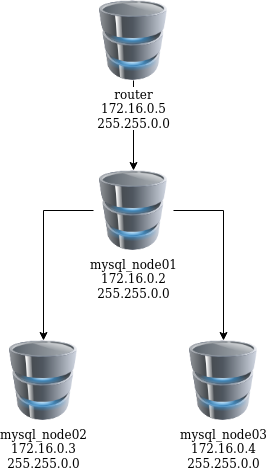
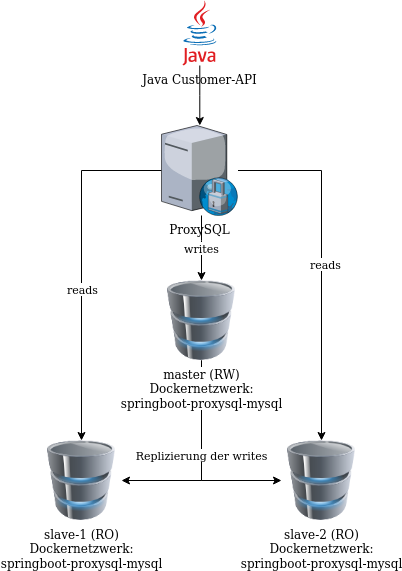

# MySQL Replikation

## Vorbereitung

Repository klonen:

```bash
git clone https://github.com/garutilorenzo/mysql-innodb-cluster && cd mysql-innodb-cluster
```

### Netzwerkplan



### Configfiles

#### Master

```conf
[mysqld]

server-id = 1
port = 3306

binlog_format = ROW

gtid_mode=ON
enforce-gtid-consistency=true

log-slave-updates
log_bin = mysql-bin

default_storage_engine = InnoDB

# replication

report-host = mysql_node01
slave_net_timeout = 60

skip-slave-start

transaction_isolation = 'READ-COMMITTED'

binlog_checksum = NONE
relay_log_info_repository = TABLE
transaction_write_set_extraction = XXHASH64

auto_increment_increment = 1
auto_increment_offset = 2

binlog_transaction_dependency_tracking = WRITESET 
slave_parallel_type = LOGICAL_CLOCK
slave_preserve_commit_order = ON
```

Den Servern muss man eine ID geben, um sie zu identifizieren. Port sollte per Default auf 3306 laufen. Das Binary-Log Format ```ROW``` heisst, dass es notiert, was geändert wurde, generiert aber eher grössere Logs. Für die Datenkonsistenz ist dies aber sehr wichtig, denn wenn z.B ```Statement-based``` verwendet wird und die ersten 1000 Datensätze auf dem Master gelöscht werden, aber die ersten 1000 Datensätze auf den Replicas andere sind, löscht man falsche Daten. Die Storage ist InnoDB, wobei für solche Replicas auch gut Network Database (NDB) verwendet werden könnte. ```report-host``` ist der Hostname des Replicas. Als Isolationslevel wird hier ```READ-COMMITTED``` verwendet. Das heisst es sind ```Lost Update, Non-Repeatable Read und Phantom Read``` möglich. Mit ```binlog_transaction_dependency_tracking```, ```slave_parallel_type``` und ```slave_preserve_commit_order``` wird ein Mechanismus erzeugt, damit bei jeder Transaktion ein Zeitstempel und Hashwert angefügt wird, damit alles nacheinander ausgeführt und überprüft werden kann, dass die Daten korrekt sind. Als Hashalgorithmus wird ```XXHASH64``` verwendet.

#### Slave

```conf
[mysqld]

server-id = 2
port = 3306

binlog_format = ROW

gtid_mode=ON
enforce-gtid-consistency=true

log-slave-updates
log_bin = mysql-bin

default_storage_engine = InnoDB

# replication

report-host = mysql_node02
slave_net_timeout = 60

skip-slave-start
read_only

transaction_isolation = 'READ-COMMITTED'

binlog_checksum = NONE
relay_log_info_repository = TABLE
transaction_write_set_extraction = XXHASH64

auto_increment_increment = 1
auto_increment_offset = 2

binlog_transaction_dependency_tracking = WRITESET
slave_parallel_type = LOGICAL_CLOCK
slave_preserve_commit_order = ON
```

Ziemlich gleich, ausser das sich ```server_id``` und```report-host``` geändert hat, sowie der Slave ```read-only``` ist.

## Installation

Aktueller MySQL-Dienst herunterdahren, damit Port nicht doppelt belegt wird:

```bash
sudo systemctl disable mysql && sudo systemctl stop mysql
```

Dockercontainer mittels Docker-Compose im Hintergrund starten:

```bash
docker-compose up -d
```

Testen, ob alle Container sauber funktionieren:

```bash
docker-compose ps
```

```output
NAME                                  COMMAND                  SERVICE             STATUS              PORTS
mysql-innodb-cluster-mysql_node01-1   "docker-entrypoint.s…"   mysql_node01        running             33060-33061/tcp
mysql-innodb-cluster-mysql_node02-1   "docker-entrypoint.s…"   mysql_node02        running             33060-33061/tcp
mysql-innodb-cluster-mysql_node03-1   "docker-entrypoint.s…"   mysql_node03        running             33060-33061/tcp
mysql-innodb-cluster-router-1         "docker-entrypoint.s…"   router              running             0.0.0.0:3306->3306/tcp, 0.0.0.0:6446-6447->6446-6447/tcp, 0.0.0.0:6606->6606/tcp, :::3306->3306/tcp, :::6446-6447->6446-6447/tcp, :::6606->6606/tcp

```

```bash
docker-compose logs -f
```

Gibt Logs über alle 4 Container aus, was zu welcher Zeit passiert ist.

## Testing

Einloggen auf Node1:

```bash
docker-compose exec mysql_node01 bash
```

Verbindung von Master auf Master, um MySQL Javascript Befehle ausführen zu können.

```bash
mysqlsh --js root@mysql_node01
```

Evtl. wird man aufgefordert für ```root``` ein Passwort einzugeben. Dort einfach ```root``` verwenden.

```javascript
var cluster = dba.getCluster()
```

```javascript
cluster.status()
```

```json
{
    "clusterName": "testcluster", 
    "defaultReplicaSet": {
        "name": "default", 
        "primary": "mysql_node01:3306", 
        "ssl": "DISABLED", 
        "status": "OK", 
        "statusText": "Cluster is ONLINE and can tolerate up to ONE failure.", 
        "topology": {
            "mysql_node01:3306": {
                "address": "mysql_node01:3306", 
                "memberRole": "PRIMARY", 
                "mode": "R/W", 
                "readReplicas": {}, 
                "replicationLag": null, 
                "role": "HA", 
                "status": "ONLINE", 
                "version": "8.0.29"
            }, 
            "mysql_node02:3306": {
                "address": "mysql_node02:3306", 
                "memberRole": "SECONDARY", 
                "mode": "R/O", 
                "readReplicas": {}, 
                "replicationLag": null, 
                "role": "HA", 
                "status": "ONLINE", 
                "version": "8.0.29"
            }, 
            "mysql_node03:3306": {
                "address": "mysql_node03:3306", 
                "memberRole": "SECONDARY", 
                "mode": "R/O", 
                "readReplicas": {}, 
                "replicationLag": null, 
                "role": "HA", 
                "status": "ONLINE", 
                "version": "8.0.29"
            }
        }, 
        "topologyMode": "Single-Primary"
    }, 
    "groupInformationSourceMember": "mysql_node01:3306"
}
```

Der Node1 ist der Master und kann gelesen sowie beschrieben werden. Node2 und Node3 sind Slaves und können nur gelesen werden. Es sind alle Online und in der MySQL Version 8.0.29.

## ProxySQL und Spring Boot

### Einrichtung

```bash
git clone https://github.com/ivangfr/springboot-proxysql-mysql && cd springboot-proxysql-mysql
```

Netzwerk sind etwa so aus:



Wichtigste Proxykonfigurationen, definiert, welche Host in welcher Gruppe sind. (Lesen oder schreiben)


```conf
mysql_replication_hostgroups =
(
    { writer_hostgroup=10 , reader_hostgroup=20 , comment="host groups" }
)

mysql_servers =
(
    { address="mysql-master" , port=3306 , hostgroup=10, max_connections=100 , max_replication_lag = 5 },
    { address="mysql-slave-1" , port=3306 , hostgroup=20, max_connections=100 , max_replication_lag = 5 },
    { address="mysql-slave-2" , port=3306 , hostgroup=20, max_connections=100 , max_replication_lag = 5 }
)
```

Das erstellen von der (Docker)Infrastruktur ist nicht mehr mit Docker-Compose gemacht, sondern mit einem Shell-Skript.

```bash
./init-environment.sh
```

#### Replikation testen:

```bash
./check-replication-status.sh
```

Sollte etwas ähnliches ausgeben (nur noch mehr, ich habe es gekürzt):

```output
mysql-master
------------
File	Position	Binlog_Do_DB	Binlog_Ignore_DB	Executed_Gtid_Set
mysql-bin-1.000003	1397			752221a2-d914-11ec-ad7d-0242ac120002:1-14

mysql-slave-1
-------------
*************************** 1. row ***************************
               Slave_IO_State: Waiting for master to send event
                  Master_Host: mysql-master
                  Master_User: replication
                  Master_Port: 3306
                Connect_Retry: 60
              Master_Log_File: mysql-bin-1.000003
          Read_Master_Log_Pos: 1397
               Relay_Log_File: c0488d351948-relay-bin.000003
                Relay_Log_Pos: 1614
        Relay_Master_Log_File: mysql-bin-1.000003
             Slave_IO_Running: Yes
            Slave_SQL_Running: Yes

mysql-slave-2
-------------
*************************** 1. row ***************************
               Slave_IO_State: Waiting for master to send event
                  Master_Host: mysql-master
                  Master_User: replication
                  Master_Port: 3306
                Connect_Retry: 60
              Master_Log_File: mysql-bin-1.000003
          Read_Master_Log_Pos: 1397
               Relay_Log_File: a5f6e2fee6af-relay-bin.000003
                Relay_Log_Pos: 1614
        Relay_Master_Log_File: mysql-bin-1.000003
             Slave_IO_Running: Yes
            Slave_SQL_Running: Yes
```

#### Proxy testen

```bash
./proxysql-admin.sh
```

Dies öffnet eine Adminshell. Folgende Befehle zum testen nutzen:

```sql
SELECT * FROM mysql_servers;
```

|hostgroup_id|hostname|port|gtid_port|status|weight|compression|max_connections|max_replication_lag|use_ssl|max_latency_ms|comment|
|:----|:----|:----|:----|:----|:----|:----|:----|:----|:----|:----|:----|
|10|mysql-master|3306|0|ONLINE|1|0|100|5|0|0| |
|20|mysql-slave-1|3306|0|ONLINE|1|0|100|5|0|0| |
|20|mysql-slave-2|3306|0|ONLINE|1|0|100|5|0|0| |


```sql
SELECT * FROM global_variables;
```

Gibt ganz viele Variablen aus.

#### Customer-API

In einem neuen Terminal Customer-API starten:

```bash
./mvnw clean spring-boot:run --projects customer-api
```

Swagger API-Doc erreichbar unter: http://localhost:8080/swagger-ui.html

### Simulation

#### Terminals vorbereiten

Master:

```bash
docker exec -it -e MYSQL_PWD=secret mysql-master mysql -uroot --database customerdb
```

Slave 1:

```bash
docker exec -it -e MYSQL_PWD=secret mysql-slave-1 mysql -uroot --database customerdb
```

Slave2:

```bash
docker exec -it -e MYSQL_PWD=secret mysql-slave-2 mysql -uroot --database customerdb
```

#### Variablen setzen

```sql
SET GLOBAL general_log = 'ON';
SET global log_output = 'table';
```

#### API verwenden

Neues Terminal öffnen und folgendes eingeben (erstellt neuen Customer):

```bash
curl -i -X POST http://localhost:8080/api/customers \
  -H 'Content-Type: application/json' \
  -d '{"firstName": "Ivan", "lastName": "Franchin"}'
```

Folgendes wurde erstellt:

```json
{"id":1,"firstName":"Ivan","lastName":"Franchin"}
```

Auf dem Master:

```sql
SELECT event_time, command_type, SUBSTRING(argument,1,250) argument FROM mysql.general_log
WHERE command_type = 'Query' AND (argument LIKE 'insert into customers %' OR argument LIKE 'select customer0_.id %' OR argument LIKE 'update customers %' OR argument LIKE 'delete from customers %');
```

Das Create wurde im Log aufgezeichnet:

|event_time|command_type|argument|
|:----|:----|:----|
|2022-05-21 15:02:19.453378|Query|insert into customers (created_at, first_name, last_name, updated_at) values ('2022-05-21 15:02:19', 'Ivan', 'Franchin', '2022-05-21 15:02:19')|

Im Curl Terminal:

```bash
curl -i http://localhost:8080/api/customers/1
```

Gibt uns auch den Customer zurück:

```json
{"id":1,"firstName":"Ivan","lastName":"Franchin"}
```

Auf dem Slave wurde das Event auch gespeichert, da die Anfrage zu ihm gelangte. Sollte auf dem anderem Slave also nicht erscheinen:

```bash
SELECT event_time, command_type, SUBSTRING(argument,1,250) argument FROM mysql.general_log
WHERE command_type = 'Query' AND (argument LIKE 'insert into customers %' OR argument LIKE 'select customer0_.id %' OR argument LIKE 'update customers %' OR argument LIKE 'delete from customers %');
```

|event_time|command_type|argument|
|:----|:----|:----|
|2022-05-21 15:04:20.229575|Query|select customer0_.id as id1_0_0_, customer0_.created_at as created_2_0_0_, customer0_.first_name as first_na3_0_0_, customer0_.last_name as last_nam4_0_0_, customer0_.updated_at as updated_5_0_0_ from customers customer0_ where customer0_.id=1|

Customer updaten im Curl-Terminal:

```bash
curl -i -X PUT http://localhost:8080/api/customers/1 \
  -H 'Content-Type: application/json' \
  -d '{"firstName": "Ivan2", "lastName": "Franchin2"}'
```

Customer hat nun eine 2 hinten, ist aber noch derselbe.

```json
{"id":1,"firstName":"Ivan2","lastName":"Franchin2"}
```

Auf Master ausführen:

```sql
SELECT event_time, command_type, SUBSTRING(argument,1,250) argument FROM mysql.general_log
WHERE command_type = 'Query' AND (argument LIKE 'insert into customers %' OR argument LIKE 'select customer0_.id %' OR argument LIKE 'update customers %' OR argument LIKE 'delete from customers %');
```

Das Update steht nun im Log:

|event_time|command_type|argument|
|:----|:----|:----|
|2022-05-21 15:02:19.453378|Query|insert into customers (created_at, first_name, last_name, updated_at) values ('2022-05-21 15:02:19', 'Ivan', 'Franchin', '2022-05-21 15:02:19')|
|2022-05-21 15:12:17.522493|Query|update customers set created_at='2022-05-21 15:02:19', first_name='Ivan2', last_name='Franchin2', updated_at='2022-05-21 15:12:17' where id=1|

Customer löschen im Curl-Terminal:

```bash
curl -i -X DELETE http://localhost:8080/api/customers/1
```

Auf dem Master sollte nun auch die Löschung erscheinen:

```sql
SELECT event_time, command_type, SUBSTRING(argument,1,250) argument FROM mysql.general_log
WHERE command_type = 'Query' AND (argument LIKE 'insert into customers %' OR argument LIKE 'select customer0_.id %' OR argument LIKE 'update customers %' OR argument LIKE 'delete from customers %');
```

|event_time|command_type|argument|
|:----|:----|:----|
|2022-05-21 15:02:19.453378|Query|insert into customers (created_at, first_name, last_name, updated_at) values ('2022-05-21 15:02:19', 'Ivan', 'Franchin', '2022-05-21 15:02:19')|
|2022-05-21 15:12:17.522493|Query|update customers set created_at='2022-05-21 15:02:19', first_name='Ivan2', last_name='Franchin2', updated_at='2022-05-21 15:12:17' where id=1|
|2022-05-21 15:14:26.564386|Query|delete from customers where id=1|
